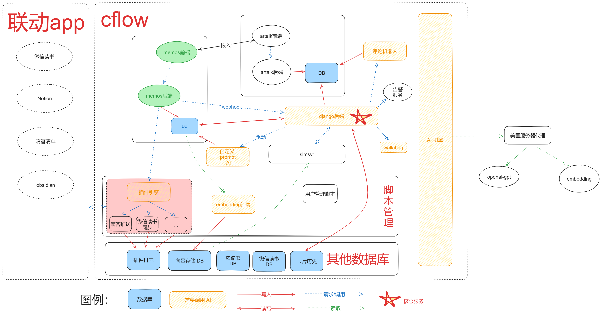
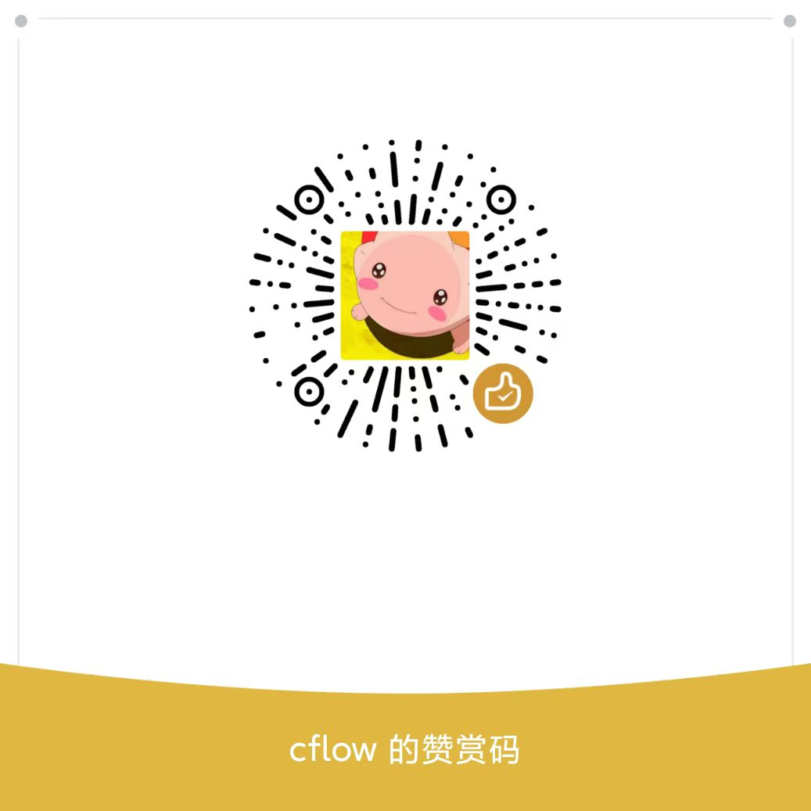

```
 ██████╗███████╗██╗      ██████╗ ██╗    ██╗
██╔════╝██╔════╝██║     ██╔═══██╗██║    ██║
██║     █████╗  ██║     ██║   ██║██║ █╗ ██║
██║     ██╔══╝  ██║     ██║   ██║██║███╗██║
╚██████╗██║     ███████╗╚██████╔╝╚███╔███╔╝
 ╚═════╝╚═╝     ╚══════╝ ╚═════╝  ╚══╝╚══╝
 ```

- [说明](#说明)
- [关于本仓库](#关于本仓库)
  - [支持的功能](#支持的功能)
  - [暂未包含功能](#暂未包含功能)
- [其他说明](#其他说明)
- [使用方法](#使用方法)
  - [编译](#编译)
  - [dockerhub](#dockerhub)
  - [咖啡？NO!](#咖啡no)

# 说明
cflow为个人魔改版[memos](https://github.com/usememos/memos)，基于官方0.18.2版本开发。

视频演示：[B站视频](https://www.bilibili.com/video/BV1q6421Z7yw/)

cflow 主要为个人使用(借助 GPT4)定制开发的魔改应用，并非为了开源而设计，所以代码质量差等问题请见谅(能运行就行原则)。

如有其他需求，欢迎自行二次魔改。

# 关于本仓库
本仓库并未完全包含上述[视频](https://www.bilibili.com/video/BV1q6421Z7yw/)所有功能，整体功能框架如下图所示：


本仓库仅包含上图绿色部分代码（即 memos 主站），而完整架构还包含：
- **Django 后端服务**：由于本人技术栈为 python，并不熟悉 go 语言，所以所有后端go语言不会实现的功能，皆通过接口转发至个人django服务来实现
  - 大部分功能皆通过此服务来调用其他服务
  - 当前该服务代码年代久远，和个人其它应用合用，代码参差不齐，较难剥离出一个干净的 cflow 专用后端，待有空处理。
- Artalk：详情页评论模块，需独立部署
- simsvr：相似度计算服务，用于各种基于 AI 的相似计算场景
- LLM_API：自研的一个可以集成各种 AI 服务（主要是 chat 和计算 embedding）的模块，除了服务于 cflow，也服务于个人其他服务器上部署的 AI 应用
  - 由于本人服务器在香港，还单独在 US 服务器上部署了一个代理转发 openai 接口的服务
- wallabag：除了服务于个人正常稍后阅读需求，也为 cflow 提供基于 API 的正文提取和标题提取服务
- 告警服务：基于 gotify 实现，用于监控推送 AI 服务状况，后端异常等问题
- 一大堆脚本（一般用于crontab例行化调度）
  - embedding 计算更新
  - 插件系统（这里涉及脚本无数）
  - obsidian白板同步脚本
  - 微信读书相关脚本
  - 滴答清单相关脚本
  - artalk相关脚本
  - Notion相关脚本
  - ...
- 其他DB（sqlite/Mysql）
  - 卡片历史
  - 插件运行日志
  - Embedding 离线存储
  - 个人微信读书相关数据缓存
  - 书籍摘要：寻书模式使用

故：**所有涉及 memos 外部服务的功能**，此仓库版本**暂时**无法体验，具体见下面章节。

非绿色部分代码由于还存在以下问题，暂时无法开源：
- 很多服务代码和个人其他项目代码混在一起了
  - 尤其 django，以前的其他视频（比如[这个](https://www.bilibili.com/video/BV1S541197f7/),[这个](https://www.bilibili.com/video/BV12G411H7S3/)）皆有提及此服务
- 也有一个代码文件里面实现多种功能，很多功能与 cflow 无关
  - 比如微信读书相关接口里面还有个人热力图/读书币管理，滴答清单插件脚本自动判断并API完成卡片复习任务等，剥离工作量较大（而且还要测试）
- python2，python3代码皆有涉及
- python 代码里面硬编码了大量的文件路径和域名，端口，账号密码
- 因为主机配置不高，使用同一个memos django 后端服务同时处理cflow正式和测试环境的请求（而不是分开部署测试和正式环境的 django 后端）
  - 所以会有后端配置功能众多，不配齐的话服务大概率启动会报错
- 如此大量服务较难打包进一个 docker 镜像里面。
- 质量混乱的代码直接开源，势必会带来大量的答疑工作负担

## 支持的功能
> 👍：表示个人推荐使用功能～

- 编辑器
  - 列表操作优化👍
    - 移动端缩进按钮
  - 收缩块语法👍
  - 表格快速增加行列👍
  - 全屏👍（**再次求助，如何可以捕获 ESC 按键实现快速退出全屏**）
  - 标签推荐支持拼音匹配👍
  - 显示有效字数
  - 检测当前内容与后台内容是否一致
- 自定义卡片样式👍
- 下拉自动加载新卡片
- 双链
  - 快速引用
    - 引用自动增加标签
  - 引用预览👍
- 自定义快捷输入👍
- 搜索优化
  - 交互式配置搜索条件👍
  - 搜索宏 & 复杂搜索语法（鼠标悬浮到放大镜可见）👍
  - 搜索结果高亮（部分语法无法支持）👍
  - 搜索结果卡片数显示
  - 标签搜索支持切换精确匹配还是包含次级别
- 热力图
  - 历史全时段热力图👍
  - 发表时间分布图👍
- 标签
  - 标签使用数量显示
  - 标签辐射图
  - 收藏标签(在标签选择器内置顶)
- 单独的待办归档页👍
- 资源
  - 编辑器存量资源支持重命名👍
  - 资源库支持双击重命名
  - 截图重命名
  - excalidraw 绘图支持👍
    - 分卡片缓存
- 设置支持关闭各种入口（详见设置）
- 一些官方最新版本已经支持（但官方0.18.2不支持）的功能：
  - markdown：
    - mermaid 语法
    - 嵌入 html👍
    - 黑幕语法
    - 上下标
  - 资源拖动排序👍
  - 标签重命名

## 暂未包含功能
- 所有 AI 功能（依赖外部服务 & AI 模块）
  - 相似卡片推荐
  - 标签推荐
  - URL 总结
  - 自定义 prompt
  - ...
- url 自动获取标题（依赖 wallabag）
- excalidraw 二次编辑（依赖后端存储哪些资源是 excalidraw 资源）
- 一些个人瞎设计的 伪·MarkDown 语法（不通用，且容易导致其他人卡片解析出问题）
- 评论（依赖 artalk）
  - 评论机器人(依赖 AI)
- 私密分享链接（依赖 django 后端生成密钥）
- 标签血缘 & 卡片血缘（依赖 django 实现）
- 卡片历史版本管理（依赖 django 实现）
- 标签
  - 切换精确/非精确标签使用数量（依赖 django 计算的统计结果，但是搜索功能中可以切换这些匹配模式）
  - 标签矩阵图（依赖 django 计算一些绘图元数据）
- 卡片问答（依赖 django 和 AI 功能）
- 随机漫步（依赖 django 和 AI 功能）
- 插件功能（依赖大量大量的外部服务）

> 本人长期目标是希望将后端逐步替换成个人更加熟悉，且方便接入AI生态的python；

# 其他说明
- 本仓库代码质量比较差（本人能力问题）,且定位为个人需求定制开发，并非官方那种for通用场景的
- 只能在 sqlite DB 下正常运行，因为个人使用的是 sqlite，魔改的时候没有考虑其他 DB
- 代码里面大量 hardcode 中文文案，并未考虑多语言版本
- 无法使用官方版本的卡片引用模式
- 无法使用官方版本的评论能力
- 开发过程中并未考虑深色模式情况下使用问题
- 原官方0.18.2版本的 DB 应该可以无缝使用（魔改过程没有改动 DB 任何字段，其他需求均通过读写其他 DB 实现），其他版本不保证可行
- 开源版本对于不支持的功能除了关闭功能，也剔除了部分代码，主要方便二次魔改不容易造成疑惑，以及防止浏览器/docker后端报一些非致命的异常提醒
- 本仓库如非严重Bug，更新频率大概率比较低，预计半年一个大版本

# 使用方法
## 编译
一般来说，机器安装 docker 后，在仓库根目录下运行：

```shell
docker build -t cflow:latest .
```

编译完成后执行下面命令启动：

```shell
docker run -d \
  --name cflow \
  --publish 5230:5230 \
  --volume ${data_path}:/var/opt/memos \
  cflow:latest \
  --mode prod
```

其中`${data_path}`换成自己的本地数据路径

> 国内机器可能要解决 dockerhub 被墙问题

## dockerhub
待补充。。


## 咖啡？NO!
如果你觉得这个项目对你有帮助或有启发，可以请我喝一杯。。额。。咖啡和牛奶以外的东西，毕竟我喝这两种会拉肚子。。


